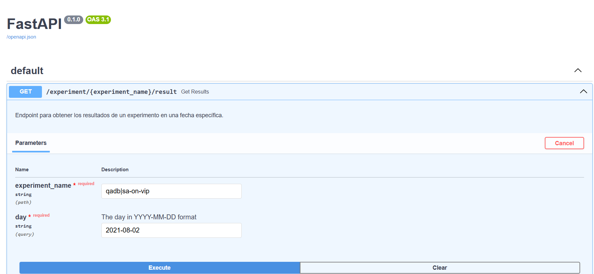
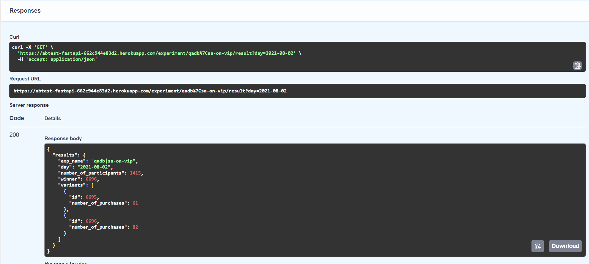

# Data Science Technical Challenge - AB Testing

## Descripción General
Este proyecto está diseñado para abordar un desafío técnico de Ciencia de Datos en el contexto de pruebas A/B. El flujo completo abarca desde la ingesta de datos hasta el análisis estadístico y la visualización de resultados, utilizando tecnologías como **Delta Lake**, **Streamlit**, **FastAPI** y herramientas avanzadas de modelado bayesiano.

---

## Tecnologías Utilizadas

1. **Python**:
   - Librerías: `pandas`, `numpy`, `plotly`, `scipy`, `numpyro`, `jax`, `arviz`.
2. **Delta Lake**:
   - Integración para ingesta y almacenamiento de datos.
3. **Streamlit**:
   - Interfaz gráfica para interactuar con los datos y generar análisis visuales.
4. **FastAPI**:
   - API para consulta de resultados de pruebas A/B.
5. **Heroku**:
   - Plataforma para desplegar la API FastAPI.
6. **AWS S3**:
   - Almacenamiento de tablas Delta utilizadas en el proyecto.

---

## Funcionalidades del Proyecto

### **1. Nivel 1: ETL (Extract, Transform, Load)**
Transformación y validación de datos en tres niveles principales:
- **Bronze**: Limpieza inicial y validación de integridad.
- **Silver**: Enriquecimiento de datos con marcas específicas como `flag_purchase`.
- **Gold**: Cálculo de métricas agregadas por experimento y variante.

#### Pasos Clave:
1. Limpieza de datos:
   - Eliminación de duplicados.
   - Validación de valores nulos y timestamps.
2. Transformación:
   - Enriquecimiento con columnas como `flag_purchase`.
   - Segmentación de experimentos y variantes.
3. Almacenamiento:
   - Los datos se almacenan como tablas Delta en AWS S3.

---

### **2. Nivel 2: Analytics**
Análisis estadístico y visual de las pruebas A/B.
- **Confianza y Correctitud**:
  - Verificación de experimentos con múltiples variantes.
  - Análisis de tasas de conversión.
- **Pruebas A/B (Chi-cuadrado)**:
  - Validación estadística de diferencias significativas entre variantes.
- **Modelo Bayesiano**:
  - Uso de NumPyro para estimar probabilidades de conversión por variante.

---

### **3. Nivel 3: API**
Despliegue de una API con FastAPI para consultar resultados de experimentos.

#### Detalles:
- **Endpoint principal**:
  ```
  /experiment/{experiment_name}/result
  ```
- **Parámetros**:
  - `experiment_name`: Nombre del experimento (usar `|` en lugar de `\`).
  - `day`: Fecha en formato `YYYY-MM-DD`.
- **Respuestas**:
  - **200**: Detalles del experimento, incluyendo la variante ganadora.
  - **404**: Mensaje de error si no se encuentran datos para el experimento y fecha.

#### Despliegue:
La API está disponible en Heroku:
```
https://abtest-fastapi-662c944e83d2.herokuapp.com
```

---

### **4. Nivel 4: Llamadas API**
Interfaz en Streamlit para interactuar con la API.
- Selección de experimentos y fechas desde los datos.
- Consulta de resultados a través de solicitudes HTTP.
- Visualización de las respuestas directamente en la aplicación.

---

## Cómo Ejecutar el Proyecto

1. **Requisitos Previos**:
   - Python >= 3.8.
   - Librerías especificadas en `requirements.txt`.
   - Configuración de credenciales AWS para acceso a S3.

2. **Ejecutar la Interfaz Streamlit**:
   ```bash
   streamlit run app.py
   ```

3. **Despliegue de la API**:
   - Crear un archivo `Procfile`:
     ```
     web: uvicorn main:app --host=0.0.0.0 --port=${PORT}
     ```
   - Subir el proyecto a Heroku:
     ```bash
     git push heroku main
     ```

---

## Repositorio
El código completo está disponible en el siguiente repositorio de GitHub:
[fastapi-abtest-meli](https://github.com/DanielGrass/fastapi-abtest-meli)

---

## Notas Adicionales
- Los experimentos deben tener variantes múltiples para ser válidos.
- Reemplazar caracteres `\` por `|` en nombres de experimentos al usar la API.
- Las tablas Delta están estructuradas en niveles (Bronze, Silver, Gold) para facilitar el procesamiento y análisis.

## Imágenes


