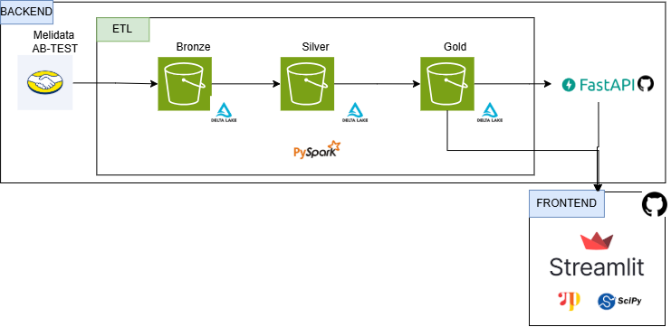

# Proyecto: AB Testing - MELI Challenge by Daniel Grass
## Diciembre 2024


## Descripción General
Este proyecto está diseñado para gestionar, procesar y analizar datos relacionados con pruebas A/B utilizando una arquitectura moderna de análisis de datos. Integra un **pipeline ETL** alojado en AWS S3 con tablas Delta Lake, junto con herramientas avanzadas de procesamiento y visualización como **PySpark**, **FastAPI**, y **Streamlit**. Además, se incorpora **NumPyro** para realizar análisis bayesianos en pruebas A/B, lo que permite obtener insights más profundos. La solución está estructurada en dos componentes principales: **Backend** y **Frontend**.

---

## **1. Backend**

El backend gestiona todo el procesamiento de datos, almacenamiento, y la exposición de la información analizada a través de una API.

### **1.1 Pipeline ETL**

El pipeline ETL procesa los datos de las pruebas A/B y los transforma a través de tres capas: **Bronze**, **Silver**, y **Gold**.

- **Bronze:**
  - Carga los datos sin procesar desde las fuentes originales, como `Melidata AB-Test`.
  - Verifica la calidad de los datos, eliminando duplicados y valores nulos.
  - Almacena los datos en formato Delta Lake dentro de un bucket S3.

- **Silver:**
  - Enriquecimiento de los datos. Por ejemplo, genera variables como `flag_purchase` para identificar eventos de compra en las sesiones.
  - Limpieza avanzada y normalización de datos, como la explosión de datos de experimentos en clave-valor (`experiment_name` y `variant_id`).
  - Los datos se transforman y almacenan en otra tabla Delta Lake en el bucket S3.

- **Gold:**
  - Cálculo de métricas agregadas, como tasas de conversión y número de usuarios únicos por experimento y variante.
  - Construcción de un túnel de eventos para el análisis de las etapas del funnel.
  - Almacenamiento en formato Delta Lake en el bucket S3.

Estas transformaciones se realizan con **PySpark**, lo que garantiza un procesamiento eficiente para grandes volúmenes de datos.

### **1.2 FastAPI**

Una API RESTful, implementada con **FastAPI**, expone los datos procesados en la capa **Gold** para ser consumidos por aplicaciones externas o el frontend.
- Los endpoints permiten obtener métricas como la variante ganadora de un experimento, usuarios por variante, y eventos en el túnel.
- Está desplegada en Heroku y documentada con Swagger UI para facilitar el consumo.

---

## **2. Frontend**

El frontend está diseñado para la visualización y análisis interactivo de los datos utilizando **Streamlit**.
- Proporciona una interfaz amigable que permite explorar las métricas y los datos procesados en las capas **Bronze**, **Silver**, y **Gold**.
- Genera gráficos interactivos para analizar:
  - El comportamiento de los usuarios en los experimentos.
  - Las tasas de conversión por variante.
  - La evolución de los eventos en el túnel de conversión.
- Integra **NumPyro** para realizar análisis bayesianos de las pruebas A/B, como la comparación de tasas de conversión entre variantes.

---

## **Flujo de Datos**

1. Los datos crudos de las pruebas A/B llegan desde `Melidata AB-Test` y se almacenan en la capa **Bronze**.
2. El pipeline ETL transforma y enriquece los datos, llevándolos a las capas **Silver** y **Gold** en formato Delta Lake.
3. Los datos procesados se exponen a través de:
   - **FastAPI** para consultas programáticas.
   - **Streamlit** para visualización interactiva y análisis estadísticos.

---

## **Herramientas y Tecnologías**

- **AWS S3 y Delta Lake:** Almacenamiento escalable y eficiente con soporte para transacciones ACID.
- **PySpark:** Procesamiento distribuido para manejar grandes volúmenes de datos.
- **FastAPI:** API rápida y ligera para exponer datos procesados.
- **Streamlit:** Interfaz interactiva para análisis y visualización.
- **NumPyro:** Modelado bayesiano para análisis avanzado de pruebas A/B.
- **Heroku:** Plataforma de despliegue para la API y el frontend.



## Requisitos de Instalación

Para ejecutar este proyecto, asegúrate de tener instalados los siguientes software:

- [Python 3.9](https://www.python.org/downloads/)
- [pip](https://pip.pypa.io/en/stable/installation/)

### Instalación

1. Clona el repositorio:

   ```bash
   git clone https://github.com/DanielGrass/AB-MELI.git
   cd AB-MELI

2. Crea y activa un entorno virtual:

- En Windows:

    ```bash
    python -m venv venv
    .\venv\Scripts\activate

- En macOS/Linux:

    ```bash    
    python3 -m venv venv
    source venv/bin/activate

3. Instala las dependencias:
    ```bash    
    pip install -r requirements.txt

4. Ejecuta la aplicación:
    ```bash    
    streamlit run app.py
    
### Componentes Principales:
1. **ETL**:
   - Transformación de datos en tres niveles (Bronze, Silver, Gold).
   - Limpieza, enriquecimiento y agregación de métricas.
2. **Analytics**:
   - Análisis estadísticos y bayesianos para evaluar variantes de experimentos.
   - Visualizaciones detalladas usando **Plotly**.
3. **API**:
   - FastAPI para exponer los resultados de los experimentos. **Nota**: Este se encuentra en el siguiente repositorio de [Github](https://github.com/DanielGrass/fastapi-abtest-meli) 
   - Documentación interactiva disponible.
4. **Llamadas API**:
   - Ejecución de solicitudes a la API y visualización de respuestas desde el front-end en streamlit.

---

## Documentación de hipótesis y asunciones

### Hipótesis del Negocio
- Los experimentos A/B cuentan con datos limpios y correctamente etiquetados.
- La tasa de conversión es una métrica clave para evaluar el rendimiento de las variantes.
- Las variantes con mayores compras tienen un mejor desempeño.

### Hipótesis Técnicas
- Los datos de entrada están estructurados en tablas Delta alojadas en S3.
- Fechas y experimentos en los datos no tienen inconsistencias.
- El análisis bayesiano supone probabilidades de conversión con una distribución Beta.

---

## Documentación para interpretar la resolución

### Niveles del Proyecto:
1. **Nivel 1 (ETL)**:
   - Transformación en niveles (Bronze, Silver, Gold) para limpiar y enriquecer datos.
2. **Nivel 2 (Analytics)**:
   - Cálculo de tasas de conversión y análisis estadísticos.
3. **Nivel 3 (API)**:
   - Exposición de resultados mediante FastAPI. [Github](https://github.com/DanielGrass/fastapi-abtest-meli) 
4. **Nivel 4 (Llamadas API)**:
   - Consulta de la API desde Streamlit.

### Errores Potenciales:
- Datos faltantes o mal formateados pueden afectar los análisis.
- Modelos estadísticos dependen de la calidad de los datos.

---

## Escalabilidad y tradeoffs futuros

1. **Limitaciones Actuales**:
   - Uso de pandas y consultas directas en tablas Delta no son ideales para grandes volúmenes.
   - Spark puede requerir optimización adicional.

2. **Estrategias de Escalabilidad**:
   - Bases de datos distribuidas como Redshift o Snowflake.
   - Reemplazar pandas con Dask o PySpark.
   - Escalar la API con AWS Lambda o contenedores.

3. **Tradeoffs**:
   - Escalar puede aumentar costos operativos.
   - Migrar a tecnologías distribuidas requiere más recursos.

---

## URL de la API y ejemplos de consulta

1. **URL Base**:
   ```
   https://abtest-fastapi-662c944e83d2.herokuapp.com
   ```

2. **Ejemplo 1: Resultado satisfactorio**:
   ```
   https://abtest-fastapi-662c944e83d2.herokuapp.com/experiment/qadb|sa-on-vip/result?day=2021-08-01
   ```

   **Respuesta**:
   ```json
   {
       "results": {
           "exp_name": "qadb|sa-on-vip",
           "day": "2021-08-01",
           "number_of_participants": 3500,
           "winner": 1,
           "variants": [
               {
                   "id": 1,
                   "number_of_purchases": 1500
               },
               {
                   "id": 2,
                   "number_of_purchases": 1200
               },
               {
                   "id": 3,
                   "number_of_purchases": 800
               }
           ]
       }
   }
   ```

3. **Ejemplo 2: Fecha sin resultados**:
   ```
   https://abtest-fastapi-662c944e83d2.herokuapp.com/experiment/qadb|sa-on-vip/result?day=2024-08-01
   ```

   **Respuesta**:
   ```json
   {
       "detail": "No data found for experiment 'qadb|sa-on-vip' on day '2024-08-01'"
   }
   ```

---

## Autor
**Daniel Grass - dgrassg@gmail.com - +57 3007024862**
